<div align="center">


# rohy — Low-Level Design

**A technical deep dive into how rohy actually works.**

Go + Wails + Svelte · version stated in [README.md](README.md)

</div>

---

## 0. Read this first

This document explains **how rohy is built**, one layer at a time. It is written
for someone who has never seen the codebase — including someone in their first
year of writing software. Every section follows the same shape:

> **What it does** → **How it works** → **Why it was built that way**

That last part matters most. Almost every unusual decision in rohy exists
because the obvious version was tried first and measured, and it lost. Where
that happened, the numbers are in the text.

### Three ideas that explain most of the codebase

If you only remember three things, remember these. They come up in nearly every
section below.

| Idea                                | What it means in practice                                                                                                                                            |
| ----------------------------------- | -------------------------------------------------------------------------------------------------------------------------------------------------------------------- |
| **Evidence is never edited**        | What gets ingested is stored exactly as ingested. Opinions (findings, layout, enabled-flags) live in separate files _beside_ the data, never inside it.               |
| **Never lie about missing data**    | An event with no timestamp shows `—`, not a made-up date. A rule that matched nothing leaves no graph. A count that excludes rows says so.                            |
| **Inferred ≠ asserted**             | A relation a rule produced (`created_by: system`) and a relation a human drew (`created_by: user`) are stored, filtered, and drawn differently. They never look alike. |

### Conventions used here

- `P4`, `P17`, `R-V1` in source comments are **phase** and **rule** identifiers
  from the project's build plan. You will see them in code comments. They are
  historical markers, not something you need to look up.
- File references look like [backend/graphene/schema.go](backend/graphene/schema.go)
  and are clickable.
- Diagrams are Mermaid and render inline on GitHub.

### Glossary (skim now, refer back later)

| Term                     | Meaning                                                                                                              |
| ------------------------ | -------------------------------------------------------------------------------------------------------------------- |
| **EVTX**                 | Windows' binary event-log file format. `.evtx` files live in `C:\Windows\System32\winevt\Logs`.                       |
| **Channel**              | A named log stream inside Windows — `Security`, `System`, `Microsoft-Windows-PowerShell/Operational`.                 |
| **Record ID**            | A monotonically increasing number Windows assigns each record within a channel. Used as a resume bookmark.            |
| **Node / Edge**          | Graph database terms. rohy stores each event as a **node** and each relation as an **edge**.                          |
| **Property index**       | A secondary lookup structure: "which nodes have `channel = Security`?" Avoids scanning everything.                    |
| **WAL**                  | Write-Ahead Log. Changes are appended to a log before being applied, so a crash can be replayed rather than lost.     |
| **Hydrate**              | Decode a stored record from bytes back into a Go struct. Expensive when done for thousands of rows.                   |
| **Cold store**           | A place to keep rarely-read bulky data so it is not loaded with everything else. rohy has one for raw event payloads. |
| **Sidecar**              | A small JSON file stored next to the main database, holding something the database deliberately does not own.         |
| **Idempotent**           | Running it twice gives the same result as running it once. Re-ingesting a file adds no duplicates.                    |
| **Binding**              | A Go method Wails exposes to JavaScript. The frontend calls it like an async function.                                |

---

## 1. The system in one picture

rohy is **one process**. There is no server, no daemon, no network call. Wails
embeds a native webview (WebView2 on Windows, WebKitGTK on Linux, WKWebView on
macOS) into a Go binary, and the two halves talk over an in-process bridge.

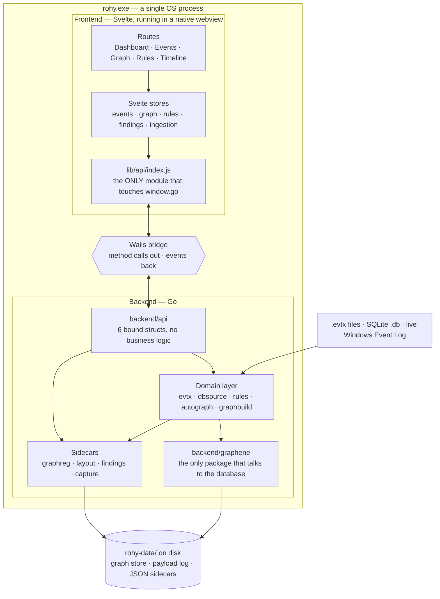
```mermaid
flowchart TB
    subgraph proc["rohy.exe — a single OS process"]
        direction TB
        subgraph fe["Frontend — Svelte, running in a native webview"]
            routes["Routes<br/>Dashboard · Events · Graph · Rules · Timeline"]
            stores["Svelte stores<br/>events · graph · rules · findings · ingestion"]
            apiw["lib/api/index.js<br/>the ONLY module that touches window.go"]
            routes --> stores --> apiw
        end

        bridge{{"Wails bridge<br/>method calls out · events back"}}

        subgraph be["Backend — Go"]
            bind["backend/api<br/>6 bound structs, no business logic"]
            work["Domain layer<br/>evtx · dbsource · rules · autograph · graphbuild"]
            persist["backend/graphene<br/>the only package that talks to the database"]
            side["Sidecars<br/>graphreg · layout · findings · capture"]
            bind --> work --> persist
            bind --> side
            work --> side
        end

        apiw <--> bridge <--> bind
    end

    disk[("rohy-data/ on disk<br/>graph store · payload log · JSON sidecars")]
    persist --> disk
    side --> disk

    src[".evtx files · SQLite .db · live Windows Event Log"] --> work
```

**Why a single process?** The data is forensic evidence. A client/server split
would mean evidence crossing a socket, a second thing to secure, and a second
thing to install. rohy's promise is "your case data never leaves the machine",
and the simplest way to keep a promise like that is to have nowhere for the data
to go.

---

## 2. Repository map

```
rohy/
├── main.go                  Wails entry point: window options + which structs to bind
├── app.go                   Lifecycle: open stores, wire bindings, startup/shutdown
│
├── backend/
│   ├── api/                 Wails binding layer — the Go↔JS boundary
│   ├── consts/              Every constant, message string and enum in one file
│   ├── evtx/                Ingestion pipeline: parse, normalize, dedup, batch, persist
│   ├── dbsource/            SQLite .db reader (two documented schemas)
│   ├── capture/             Durable per-channel bookmarks for live capture
│   ├── graphene/            Persistence facade — schema, queries, ordering, timeline,
│   │                        the correlation projection and its backfill
│   ├── payload/             Append-only cold store for bulky raw records
│   ├── rules/               Rule format, validation, registry, editor descriptor
│   ├── autograph/           Correlation engine (pure; produces edges, writes nothing)
│   │                        4 algorithms + the prepared Dataset shared across a build
│   ├── graphbuild/          The workflow that runs rules and persists their graphs
│   ├── graphreg/            Registry of named graphs
│   ├── layout/              Canvas node positions and viewport
│   ├── findings/            Analyst annotations (flag, tags, note)
│   ├── utils/               Hashing primitives
│   └── version/             Build identity, injected at link time
│
├── frontend/src/
│   ├── routes/              One file per page
│   ├── components/          events/ · graph/ · rules/ · timeline/ · material/
│   ├── stores/              Svelte stores — all app state
│   └── lib/                 api/ · consts/ · rules/ · filter · shortcuts · export
│
├── build-all.{sh,ps1}       Full six-target matrix build
├── build.{sh,ps1}           Single-target release build
└── .github/workflows/       ci.yml · release.yml
```

Roughly 13,200 lines of non-test Go, plus the Svelte frontend, plus **482 Go
test functions** and **364 frontend test cases**.

---

## 3. Layering and the dependency rule

There is exactly one rule, and it is enforced by import direction:

> **A package may only import packages below it. Never sideways into a peer's
> internals, never upward.**

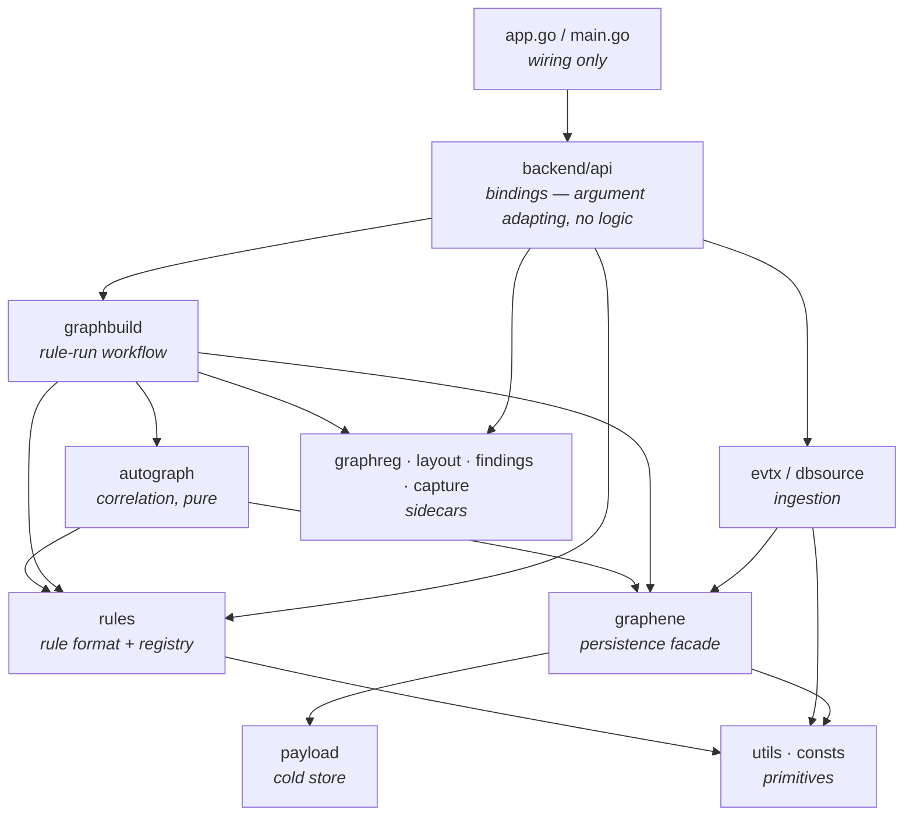
```mermaid
flowchart TD
    A["app.go / main.go<br/><i>wiring only</i>"]
    B["backend/api<br/><i>bindings — argument adapting, no logic</i>"]
    C1["evtx / dbsource<br/><i>ingestion</i>"]
    C2["graphbuild<br/><i>rule-run workflow</i>"]
    D1["autograph<br/><i>correlation, pure</i>"]
    D2["rules<br/><i>rule format + registry</i>"]
    D3["graphreg · layout · findings · capture<br/><i>sidecars</i>"]
    E["graphene<br/><i>persistence facade</i>"]
    F["payload<br/><i>cold store</i>"]
    G["utils · consts<br/><i>primitives</i>"]

    A --> B
    B --> C1
    B --> C2
    B --> D2
    B --> D3
    C2 --> D1
    C2 --> D2
    C2 --> D3
    D1 --> D2
    C1 --> E
    C2 --> E
    D1 --> E
    E --> F
    E --> G
    C1 --> G
    D2 --> G
```

Three consequences worth internalising:

1. **`graphene` is the only package that opens the database.** If you find
   yourself importing the graph library anywhere else, the design has been
   broken.
2. **`autograph` cannot write.** It returns unpersisted `Relation` values. This
   is what makes correlation trivially testable: feed it events, assert on the
   edges, no database involved.
3. **`api` holds no business logic.** Its methods parse a string into a
   `time.Time`, call one thing, and wrap the error. That is the whole job.
   Testing the bindings therefore does not require a running window.

Where a lower package needs something from above, it declares a **narrow
interface** instead of importing upward. `evtx.EventSink` is three methods;
`*graphene.Store` happens to satisfy it. `graphbuild.LayoutStore` is a single
`Delete` method. This keeps the arrows pointing one way and makes fakes trivial
in tests.

---

## 4. Cold start — what happens when you double-click rohy

The interesting problem: opening a large case means replaying a write-ahead log
and loading a property index. On a big case that is the slowest thing the app
ever does. Doing it before the window exists means the user stares at nothing
and assumes the app is broken.

So rohy **opens the window first and warms the store behind it**, reporting real
progress.

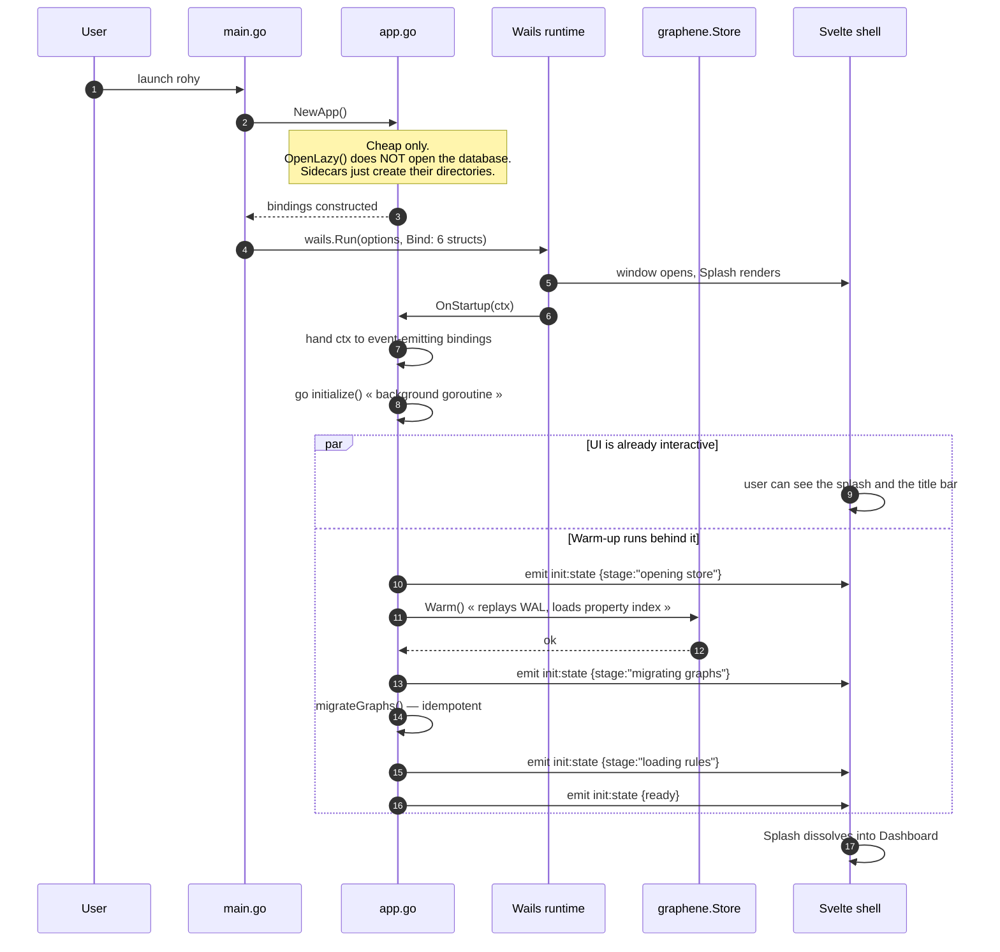
```mermaid
sequenceDiagram
    autonumber
    participant U as User
    participant M as main.go
    participant A as app.go
    participant W as Wails runtime
    participant S as graphene.Store
    participant UI as Svelte shell

    U->>M: launch rohy
    M->>A: NewApp()
    Note over A: Cheap only.<br/>OpenLazy() does NOT open the database.<br/>Sidecars just create their directories.
    A-->>M: bindings constructed
    M->>W: wails.Run(options, Bind: 6 structs)
    W->>UI: window opens, Splash renders
    W->>A: OnStartup(ctx)
    A->>A: hand ctx to event-emitting bindings
    A->>A: go initialize()   « background goroutine »

    par UI is already interactive
        UI->>UI: user can see the splash and the title bar
    and Warm-up runs behind it
        A->>UI: emit init:state {stage:"opening store"}
        A->>S: Warm()  « replays WAL, loads property index »
        S-->>A: ok
        A->>UI: emit init:state {stage:"migrating graphs"}
        A->>A: migrateGraphs() — idempotent
        A->>UI: emit init:state {stage:"loading rules"}
        A->>UI: emit init:state {ready}
    end

    UI->>UI: Splash dissolves into Dashboard
```

### The laziness is safe, not merely fast

`graphene.OpenLazy` returns a `Store` whose database is not open yet. Every
accessor funnels through `ensure()`, which is a `sync.Once`:

```go
func (s *Store) ensure() error {
    s.openOnce.Do(func() { /* open graph + payload log */ })
    return s.openErr
}
```

A call that arrives **before** warm-up finishes simply blocks until the open
completes. Laziness can therefore never surface as a nil dereference or a
half-open read — a property the `sync.Once` gives for free, along with the
happens-before edge that makes reading `s.g` lock-free afterwards.

### Failure is shown, not fatal

If warm-up fails, `initialize()` calls `System.Failed(err)` and returns. The
process stays alive and the window shows the reason. A user who can read
"permission denied on rohy-data/db" can fix it; a user whose app vanished
cannot.

### Shutdown

```go
func (a *App) shutdown(ctx context.Context) {
    a.Events.Shutdown()   // stop ingestion, let it flush + bookmark first
    a.store.Compact()     // merge delta layer, truncate the WAL
    a.store.Close()
}
```

The order matters. Draining ingestion **before** closing is what keeps a live
capture's bookmark honest: otherwise the next session would resume from a
position whose events were never written.

---

## 5. The data model

### 5.1 Two entities, and that is all

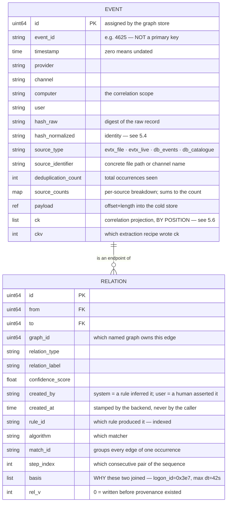
```mermaid
erDiagram
    EVENT ||--o{ RELATION : "is an endpoint of"
    EVENT {
        uint64 id PK "assigned by the graph store"
        string event_id "e.g. 4625 — NOT a primary key"
        time   timestamp "zero means undated"
        string provider
        string channel
        string computer "the correlation scope"
        string user
        string hash_raw "digest of the raw record"
        string hash_normalized "identity — see 5.4"
        string source_type "evtx_file · evtx_live · db_events · db_catalogue"
        string source_identifier "concrete file path or channel name"
        int    deduplication_count "total occurrences seen"
        map    source_counts "per-source breakdown; sums to the count"
        ref    payload "offset+length into the cold store"
        list   ck "correlation projection, BY POSITION — see 5.6"
        int    ckv "which extraction recipe wrote ck"
    }
    RELATION {
        uint64  id PK
        uint64  from FK
        uint64  to FK
        uint64  graph_id "which named graph owns this edge"
        string  relation_type
        string  relation_label
        float   confidence_score
        string  created_by "system = a rule inferred it; user = a human asserted it"
        time    created_at "stamped by the backend, never by the caller"
        string  rule_id "which rule produced it — indexed"
        string  algorithm "which matcher"
        string  match_id "groups every edge of one occurrence"
        int     step_index "which consecutive pair of the sequence"
        list    basis "WHY these two joined — logon_id=0x3e7, max dt=42s"
        int     rel_v "0 = written before provenance existed"
    }
```

A note on naming that trips people up: **`event_id` is not an identifier of a
row.** It is the Windows event type number — `4625` means "failed logon", and
thousands of rows share it. The row's identifier is `id`.

### 5.2 What is indexed, and what deliberately is not

Each event registers **nine** secondary-index entries
([schema.go](backend/graphene/schema.go)):

| Indexed key       | Serves                                        |
| ----------------- | --------------------------------------------- |
| `event_id`        | exact-match filter                            |
| `timestamp`       | range filters (`>=`, `<=`, `between`)         |
| `provider`        | exact-match filter                            |
| `channel`         | exact-match filter                            |
| `user`            | exact-match filter                            |
| `computer`        | exact-match filter                            |
| `hash_normalized` | deduplication lookup — the hot ingest path    |
| `search_blob`     | substring search                              |
| `source_type`     | exact-match filter                            |

Each relation registers **four**: `relation_type`, `created_by`, `graph_id`, `rule_id`.

`rule_id` is the only piece of provenance that is indexed, and it earns it: it answers
"which edges did this rule produce" **without first knowing which graph they landed in**,
which is what the relationship inspector, rule-inertness reporting and orphan detection
after a rename all need. A rule's id is a slug of its name, so renaming strands the graph
it built — and the id stamped on the edges is then the only way back to them.

Several things are **not** indexed on purpose:

- **`source_identifier` and `deduplication_count`** — applied after decoding.
  They are rare filters, and every extra indexed key costs memory on every
  event, forever.
- **`raw_xml`** — excluded from `search_blob` explicitly, to keep the in-memory
  index bounded. Search covers the scalar fields, not the whole record.
- **`match_id`, and every correlation slot** — near-unique keys, which is exactly the
  shape that made store open 8.0 s instead of 0.8 s when the timestamp key was declared
  ordered (§5.3). Nothing queries by them: the inspector already holds the edges it needs,
  and correlation reads the whole matching set once per build and hashes it in memory.

### 5.3 The timestamp encoding, and a measurement that overrode the textbook

Timestamps are indexed as **fixed-width UTC text**:

```go
const TimestampIndexLayout = "2006-01-02T15:04:05.000000000Z07:00"
```

Fixed width plus a forced UTC offset means **byte order equals chronological
order**, which is what makes range comparisons in the index correct.

A zero timestamp renders as year one, so undated events sort before every real
record and are excluded by any lower time bound. Unix nanoseconds would be more
compact but are undefined outside 1678–2262, so a zero time would wrap to a
nonsense value rather than to "before everything".

Now the interesting part. The graph library supports **declaring a key ordered**,
which answers range queries by binary search instead of scanning. That is the
textbook move. It was implemented, measured, and **removed**:

```
timestamp declared     100k events: open ~8.0 s
timestamp undeclared   100k events: open ~0.8 s
```

A declaration is runtime state that does not survive a reopen, so it must absorb
every already-registered entry on **every** open — and for a near-unique key like
a timestamp, that absorption dominates startup and grows worse than linearly.
Meanwhile the queries it accelerates barely moved (narrow range 1.63–1.85 ms
declared vs 1.71–1.91 ms undeclared on 20k events), because **range queries in
rohy are dominated by decoding matched records, not by locating candidate ids**.

The lesson is written into [PERFORMANCE.md](PERFORMANCE.md) as the project's
first rule: measure rohy's paths, and measure **open**, not just the query.

### 5.4 Event identity — the hashing rules

Two hashes are computed per event, and they answer different questions.

| Hash              | Over what                                     | Answers                                    |
| ----------------- | --------------------------------------------- | ------------------------------------------ |
| `hash_raw`        | the raw record bytes                          | "are these byte-for-byte the same record?"  |
| `hash_normalized` | selected scalar fields, joined with `\x1f`    | "are these the same **occurrence**?"        |

`hash_normalized` is what deduplication uses, and it has **two branches**:

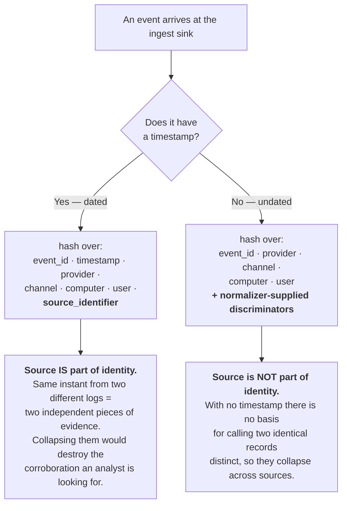
```mermaid
flowchart TD
    start["An event arrives at the ingest sink"] --> q{"Does it have<br/>a timestamp?"}

    q -- "Yes — dated" --> dated["hash over:<br/>event_id · timestamp · provider ·<br/>channel · computer · user ·<br/><b>source_identifier</b>"]
    q -- "No — undated" --> undated["hash over:<br/>event_id · provider · channel ·<br/>computer · user<br/><b>+ normalizer-supplied discriminators</b>"]

    dated --> whyD["<b>Source IS part of identity.</b><br/>Same instant from two different logs =<br/>two independent pieces of evidence.<br/>Collapsing them would destroy the<br/>corroboration an analyst is looking for."]
    undated --> whyU["<b>Source is NOT part of identity.</b><br/>With no timestamp there is no basis<br/>for calling two identical records<br/>distinct, so they collapse across sources."]
```

Why fields are joined with `\x1f` (ASCII unit separator) rather than a comma: a
control character **cannot occur in event text**, so field boundaries can never
collide by concatenation. Without it, `{"AB", "C"}` and `{"A", "BC"}` would hash
identically.

One subtlety that explains an odd-looking line in the pipeline: the per-record
normalizers do not know which file or channel the run is reading, so
`source_identifier` is stamped at the **sink**, and `ComputeNormalizedHash()` is
called again there — but **only for dated events**, because an undated event's
normalizer may have added discriminators the sink cannot see (a catalogue row's
message text) and must not drop.

### 5.5 The cold store — 70% of an event lives outside the graph

The graph database keeps its records **resident in memory**. Whatever is in an
event's property blob is loaded for every event in the case, forever. Measured
on a 40,000-event fixture with a 2 KB raw record:

```
topology only ........................  503 B/event
+ property index (9 keys) ............  867 B/event
+ raw record and parsed fields ....... 3137 B/event   ← 70% of the total
```

The raw record is read in **exactly one place**: when an analyst opens a single
event. Paying for it on every event, to serve a view of one, is the wrong trade.

So `RawXML` and `ParsedFields` are tagged `json:"-"` — excluded from the node
record — and written to an append-only log instead. The event keeps a `Ref`:
two integers standing in for kilobytes.

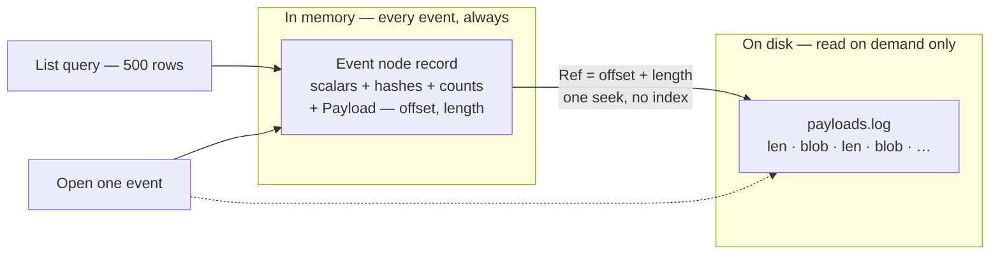
```mermaid
flowchart LR
    subgraph mem["In memory — every event, always"]
        node["Event node record<br/>scalars + hashes + counts<br/>+ Payload — offset, length"]
    end
    subgraph disk["On disk — read on demand only"]
        log["payloads.log<br/>len · blob · len · blob · …"]
    end
    node -->|"Ref = offset + length<br/>one seek, no index"| log

    q1["List query — 500 rows"] --> node
    q2["Open one event"] --> node
    q2 -.-> log
```

Design notes worth understanding:

- **The reference _is_ the index.** There is no lookup table to maintain.
- **Each record carries its own length header** (4 bytes) even though the `Ref`
  already knows it. This makes the log self-describing, so it can be walked and
  validated without the graph — which is what makes an orphaned tail after a
  crash *detectable* rather than silently misread.
- **Ordering under crash:** the payload is written and `Sync()`ed **before** the
  event referencing it is committed. A crash between the two leaves bytes nothing
  points at — wasted space, reclaimed by re-ingesting. The opposite order would
  leave an event pointing at a payload that was never written, which is
  unrecoverable. **Waste is the acceptable failure; dangling is not.**
- **Deleting an event does not reclaim its payload.** The log is append-only, so
  a delete would mean rewriting it. Space comes back by re-ingesting, which the
  project's pre-1.0 position explicitly allows.

### 5.6 The correlation projection — putting a dozen scalars back in

Section 5.5 is the story of getting bulk **out** of the node record. This one is the story of
putting a small, bounded piece of it back, and why that is not a contradiction.

v0.2.0 added matchers that correlate on EventData: a logon id, a process id, an account name
(§11). Those live in `ParsedFields`, which is in the cold store precisely because it is 70% of
an event's resident cost. But correlation needs them for **every event of every build**, and a
cold-store read per event per build would re-incur exactly the cost 5.5 removed — one seek and
one multi-kilobyte JSON decode, 100,000 times, to read a dozen bytes each.

So a **bounded, selected projection** is computed once at normalize time and stored in the node
record. Two properties make it affordable:

```go
// backend/consts — the vocabulary. Order IS the wire format.
var CorrelationSlots = []string{
    "logon_id", "subject_logon_id", "process_id", "new_process_id", "parent_process_id",
    "process_name", "target_user", "subject_user", "ip_address", "service_name",
}
```

- **Values are stored by POSITION, not by name.** A map would repeat ten key names on every
  event forever. Measured: the same values keyed by name cost **+138 B/event** of pure
  vocabulary.
- **Each slot is bounded to its own domain**, not to one generous cap — identifiers 18 bytes
  ("0x" plus the 16 hex digits of a uint64), an image basename 40, an account 32, an IPv6
  literal 45.

The budget was **measured, not chosen**, and the first measurement failed. A twelve-slot
vocabulary sharing a 64-byte cap cost **819 B/event** at the format's worst case, against a
483 B baseline node record — most of the way back to what 5.5 removed. The response was to
shrink the vocabulary, not to raise the ceiling: per-slot bounds, and two slots dropped
(`parent_process_name`, redundant with the other endpoint of a lineage edge;
`session_id`, subsumed by `logon_id`). It now costs **324 B worst case and 71 B on a
representative 4688** — about +8% typical against the 867 B/event baseline, to make field,
temporal and lineage correlation possible at all.

`TestCorrelationProjectionBudget` fails the build if that number is exceeded, measuring the
**encoded node record** rather than the heap: the heap tests carry ~1000 B/event of GC noise,
comfortably more than the whole feature's allowance, so they could not have failed for the
reason the budget exists.

Two invariants worth knowing before touching it:

- 🔒 **`CorrelationSlots` is append-only.** Reordering or reusing a slot silently reinterprets
  every event already stored — a value written as a logon id read back as a process id, with
  nothing reporting an error. A vocabulary change bumps `CorrelationKeyVersion`, which makes
  existing events detectably stale.
- 🔒 **Absent is not empty.** Windows writes `-` and the null SID constantly; the extractor maps
  those to absent, and the field matcher **excludes** such events rather than bucketing them
  under `""`. Grouping them would correlate every event that happens not to carry the field with
  every other one — which does not look like a bug, it looks like a working rule.

Events ingested before the projection existed carry none, so field rules under-report against
them. That is surfaced, never silent: runs report `StaleCorrelationKeys`, and
`BackfillCorrelationKeys` fills them in — opt-in, resumable (each event carries the recipe
version it was written under), and idempotent.

---

## 6. What lives on disk

```
<working directory>/
└── rohy-data/                     ← beside wherever you launched the app
    ├── db/                        graph store — events, relations, indexes, WAL
    │   └── payloads/
    │       └── payloads.log       append-only cold store
    ├── graphs/registry.json       named graphs + which one is active
    ├── layout/canvas-<id>.json    node positions + viewport, one file per graph
    ├── rules/                     user rule files (*.json)
    │   └── rules-state.json       per-rule enabled/disabled overrides
    ├── capture/                   per-channel live-capture bookmarks
    └── findings/findings.json     analyst flags, tags and notes
```

Two deliberate choices:

**Data sits beside the launch directory, not in `%APPDATA%`.** A working folder
is therefore self-contained and portable — copy the folder, carry the case.

**Everything that is _not_ evidence is a sidecar.** Layout is UI state; enabled
flags are preferences; findings are opinions; bookmarks are progress. None of
them belong inside the evidence store, and all of them are plain readable JSON.
The findings package states the reason explicitly: an analyst's notes may outlive
this program, and they should not need it to be read back.

---

## 7. Ingestion

This is the most involved subsystem. It has three sources, one shared pipeline,
and a set of ordering rules that make it crash-safe.

### 7.1 The shape: producer → workers → sink

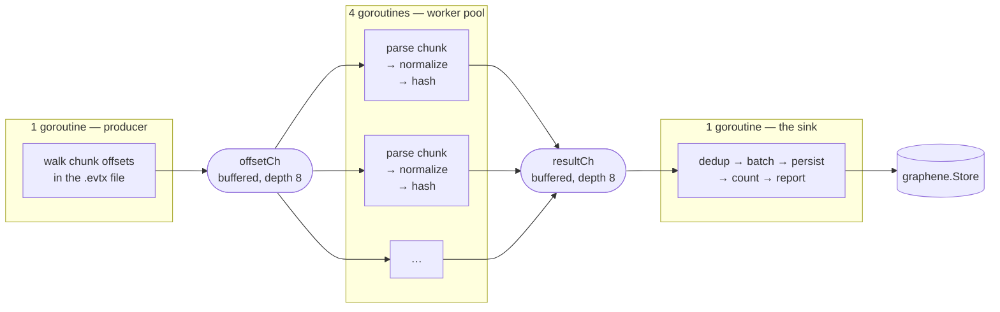
```mermaid
flowchart LR
    subgraph producer["1 goroutine — producer"]
        P["walk chunk offsets<br/>in the .evtx file"]
    end

    OC(["offsetCh<br/>buffered, depth 8"])

    subgraph workers["4 goroutines — worker pool"]
        W1["parse chunk<br/>→ normalize<br/>→ hash"]
        W2["parse chunk<br/>→ normalize<br/>→ hash"]
        W3["…"]
    end

    RC(["resultCh<br/>buffered, depth 8"])

    subgraph sink["1 goroutine — the sink"]
        S["dedup → batch → persist<br/>→ count → report"]
    end

    DB[("graphene.Store")]

    P --> OC --> W1 --> RC
    OC --> W2 --> RC
    OC --> W3 --> RC
    RC --> S --> DB
```

Why this shape:

- **Parsing is CPU-bound and parallel.** Each worker opens its **own file
  handle**, because parsing seeks the handle and a shared one would race.
- **Persisting is single-goroutine.** Everything funnels through one sink, so
  the counters and the `Reporter` need **no synchronisation at all**. That is not
  laziness — it is a deliberate trade of a little throughput for the complete
  absence of a class of bug.
- **Both channels are bounded (depth 8).** When the sink falls behind, the
  workers block; when the workers fall behind, the producer blocks. This is
  backpressure, and it is what makes **peak memory independent of input size**:
  at most 4 chunks (64 KB each) plus 8 queued batches are resident, whether the
  file is 5 MB or 5 GB.

Tuning constants ([consts.go](backend/consts/consts.go)):

| Constant           | Value | Role                                                  |
| ------------------ | ----- | ----------------------------------------------------- |
| `ParseWorkerCount` | 4     | parse/normalize concurrency                           |
| `ChunkQueueDepth`  | 8     | channel buffer depth on both channels                 |
| `EventBatchSize`   | 512   | events per durable write                              |
| `ProgressInterval` | 2000  | records between progress emissions                    |

### 7.2 Deduplication — a three-way decision per event

When `Idempotent` is on, every event hits this decision at the sink:

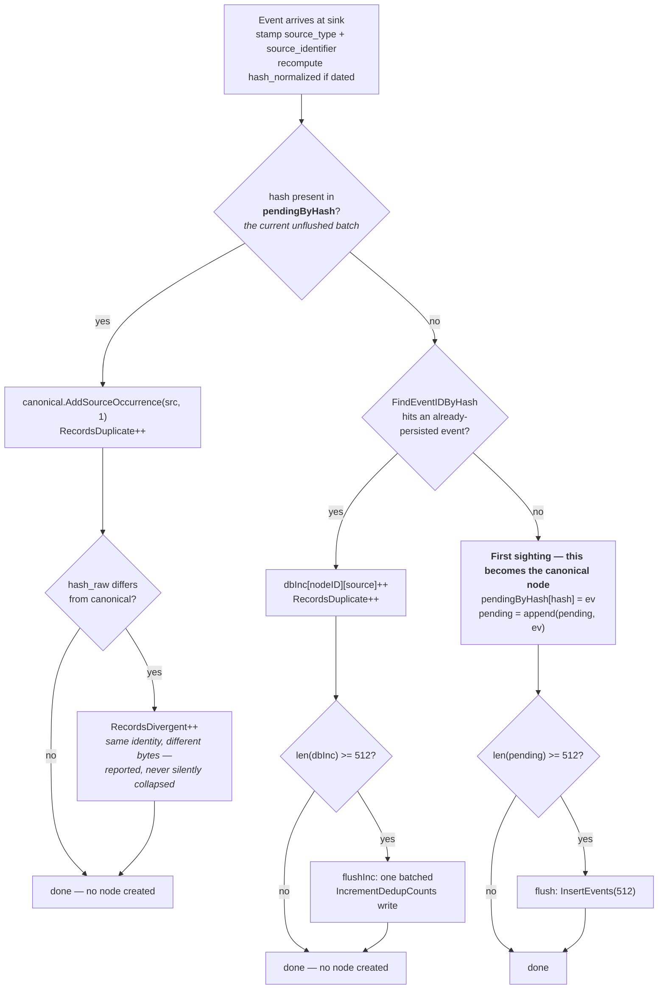
```mermaid
flowchart TD
    ev["Event arrives at sink<br/>stamp source_type + source_identifier<br/>recompute hash_normalized if dated"] --> c1{"hash present in<br/><b>pendingByHash</b>?<br/><i>the current unflushed batch</i>"}

    c1 -- yes --> a1["canonical.AddSourceOccurrence(src, 1)<br/>RecordsDuplicate++"]
    a1 --> a1b{"hash_raw differs<br/>from canonical?"}
    a1b -- yes --> a1c["RecordsDivergent++<br/><i>same identity, different bytes —<br/>reported, never silently collapsed</i>"]
    a1b -- no --> done1["done — no node created"]
    a1c --> done1

    c1 -- no --> c2{"FindEventIDByHash<br/>hits an already-<br/>persisted event?"}
    c2 -- yes --> a2["dbInc[nodeID][source]++<br/>RecordsDuplicate++"]
    a2 --> a2b{"len(dbInc) >= 512?"}
    a2b -- yes --> a2c["flushInc: one batched<br/>IncrementDedupCounts write"]
    a2b -- no --> done2["done — no node created"]
    a2c --> done2

    c2 -- no --> a3["<b>First sighting — this becomes the canonical node</b><br/>pendingByHash[hash] = ev<br/>pending = append(pending, ev)"]
    a3 --> a3b{"len(pending) >= 512?"}
    a3b -- yes --> a3c["flush: InsertEvents(512)"]
    a3b -- no --> done3["done"]
    a3c --> done3
```

Two details that are easy to miss:

- **`pendingByHash` is cleared on every flush.** Once a batch is persisted, its
  canonicals are in the database, so later duplicates must go through the
  database path. Keeping the map would grow unboundedly and, worse, would let a
  later duplicate increment an in-memory object nobody will write again.
- **`RecordsDivergent`** exists because identity deliberately excludes the raw
  payload. If two records match on identity but differ in bytes, the rule cannot
  tell them apart — but that might be wrong. It is counted and reported rather
  than hidden. It is only detected **within a batch**, where the canonical is
  still in memory; checking against already-persisted events would cost a fetch
  per duplicate.

### 7.3 Batching, and why it is the whole performance story

Every commit must reach the write-ahead log before it returns. That is what
crash-safety costs, and it is not tunable. So:

> **In rohy's write paths, the number of durable commits dominates. Property
> encoding does not. Ingest is write-bound, not CPU-bound.**

This single fact explains several otherwise-odd pieces of code:

- `InsertEvents` takes a **slice**, not one event.
- `AppendBatch` frames many payloads into **one buffer, one write**, rather than
  a syscall per record.
- `IncrementDedupCounts` takes a **map of deltas**, reads every node in one
  batched fetch, and commits all increments in a single transaction. Applied one
  at a time this was a durable write per duplicate — the dominant cost of a
  duplicate-heavy ingest.
- `InsertRelations` (used by rule builds) writes a whole chunk in one commit.

### 7.4 Pause, and the bookmark ordering rule

Live capture can be paused. Pausing does **not** abandon work — and the ordering
around it is the most safety-critical logic in the pipeline.

The rule is one sentence:

> **A capture position is only ever written AFTER the events up to it are
> durably persisted.**

A crash therefore re-reads a little, which hash idempotency collapses to nothing.
It can never **skip**.

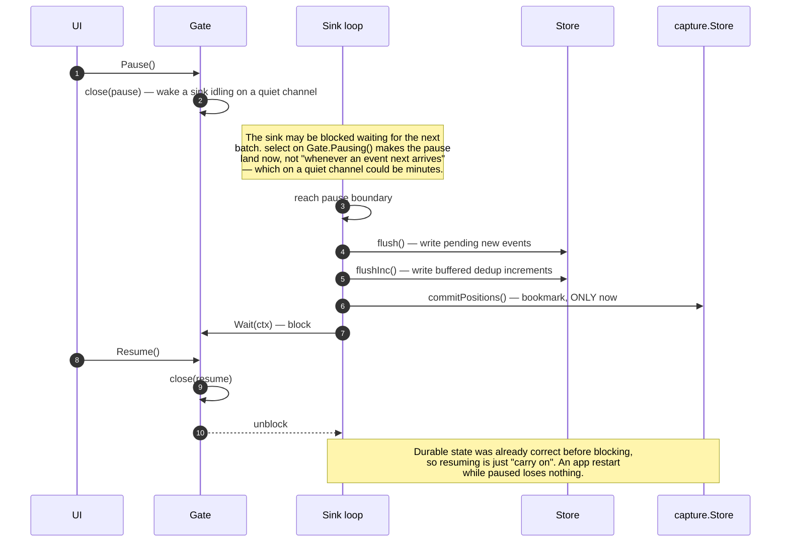
```mermaid
sequenceDiagram
    autonumber
    participant UI as UI
    participant G as Gate
    participant S as Sink loop
    participant DB as Store
    participant B as capture.Store

    UI->>G: Pause()
    G->>G: close(pause) — wake a sink idling on a quiet channel
    Note over S: The sink may be blocked waiting for the next<br/>batch. select on Gate.Pausing() makes the pause<br/>land now, not "whenever an event next arrives"<br/>— which on a quiet channel could be minutes.
    S->>S: reach pause boundary
    S->>DB: flush()      — write pending new events
    S->>DB: flushInc()   — write buffered dedup increments
    S->>B: commitPositions() — bookmark, ONLY now
    S->>G: Wait(ctx) — block

    UI->>G: Resume()
    G->>G: close(resume)
    G-->>S: unblock
    Note over S,B: Durable state was already correct before blocking,<br/>so resuming is just "carry on". An app restart<br/>while paused loses nothing.
```

`commitPositions` has a guard that repays careful reading:

```go
if opts.Positions == nil || len(staged) == 0 || len(pending) > 0 || len(dbInc) > 0 {
    return
}
```

It refuses to bookmark while **either** buffer holds unwritten work. Guarding
only `pending` would let a flush advance the bookmark past a record whose
duplicate's increment is still buffered from an earlier chunk. That is not event
loss — but it is a durable write escaping its bookmark, which is exactly what
this discipline exists to prevent.

### 7.5 Three sources, one pipeline

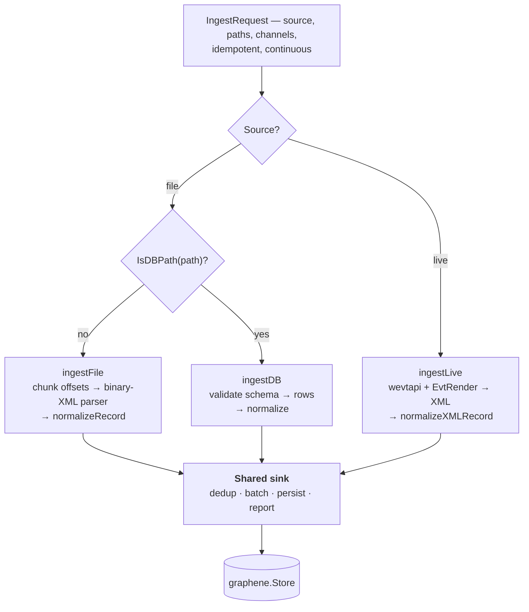
```mermaid
flowchart TD
    req["IngestRequest — source, paths, channels,<br/>idempotent, continuous"] --> disp{"Source?"}

    disp -- "file" --> isdb{"IsDBPath(path)?"}
    isdb -- "no" --> evtxf["ingestFile<br/>chunk offsets → binary-XML parser<br/>→ normalizeRecord"]
    isdb -- "yes" --> dbf["ingestDB<br/>validate schema → rows<br/>→ normalize"]
    disp -- "live" --> livef["ingestLive<br/>wevtapi + EvtRender → XML<br/>→ normalizeXMLRecord"]

    evtxf --> sink["<b>Shared sink</b><br/>dedup · batch · persist · report"]
    dbf --> sink
    livef --> sink
    sink --> store[("graphene.Store")]
```

**`.evtx` files.** Parsed with the Velocidex library, which emits ordered JSON
dicts rather than reconstructed XML — so the stored raw payload is that JSON
serialization. Timestamps come from the record header as Windows FILETIME
(100-nanosecond ticks since 1601) and are converted with a fixed epoch offset.

**SQLite `.db`.** Two documented shapes only — an `events` table, or a
`messages`/`providers` catalogue. There is **no schema sniffing**, and the
comment in [dbsource.go](backend/dbsource/dbsource.go) states why: mis-mapping
columns would silently corrupt forensic evidence, which is worse than refusing
the file. A database matching neither is rejected with a message naming both
shapes it checked. Catalogue rows have no timestamp, so they are the primary
source of **undated** events.

**Live Windows Event Log.** Uses the native `wevtapi` (Windows only; the build
uses `_windows.go` / `_other.go` file suffixes so other platforms compile a stub).
Records come back as XML via `EvtRender`, so there is a second normalizer —
[evtx_xml_normalize.go](backend/evtx/evtx_xml_normalize.go). Critically, it
hashes over **the same ordered fields** as the file normalizer, so the same
event ingested from a file and from the live log produces the **same**
`hash_normalized`. That is what makes cross-source dedup work at all, and it is
unit-tested without a running event log.

---

## 8. Reading events — the query path

The naive read path answered **one page** by hydrating every matching event — a
full JSON decode per node, multi-kilobyte raw payload included — purely to learn
each event's timestamp so the set could be sorted. Progressive loading then
repeated that entire scan for every page the user scrolled to.

Two changes fix it, and together they are the reason the events list stays usable
on a large case.

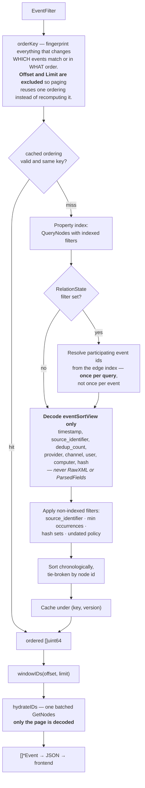
```mermaid
flowchart TD
    f["EventFilter"] --> key["orderKey — fingerprint everything that changes<br/>WHICH events match or in WHAT order.<br/><b>Offset and Limit are excluded</b> so paging<br/>reuses one ordering instead of recomputing it."]
    key --> cache{"cached ordering<br/>valid and same key?"}

    cache -- "hit" --> ids["ordered []uint64"]

    cache -- "miss" --> idx["Property index:<br/>QueryNodes with indexed filters"]
    idx --> rel{"RelationState<br/>filter set?"}
    rel -- "yes" --> relset["Resolve participating event ids<br/>from the edge index — <b>once per query</b>,<br/>not once per event"]
    rel -- "no" --> min
    relset --> min["<b>Decode eventSortView only</b><br/>timestamp, source_identifier, dedup_count,<br/>provider, channel, user, computer, hash<br/><i>— never RawXML or ParsedFields</i>"]
    min --> post["Apply non-indexed filters:<br/>source_identifier · min occurrences ·<br/>hash sets · undated policy"]
    post --> sortst["Sort chronologically,<br/>tie-broken by node id"]
    sortst --> store2["Cache under (key, version)"]
    store2 --> ids

    ids --> win["windowIDs(offset, limit)"]
    win --> hyd["hydrateIDs — one batched GetNodes<br/><b>only the page is decoded</b>"]
    hyd --> out["[]*Event → JSON → frontend"]
```

### 8.1 Cache invalidation is a counter, not a guess

```go
func (s *Store) bumpVersion() {
    s.order.version++
    s.order.valid = false
    s.order.ids = nil
}
```

Every write path calls it via `defer` — including relation writes, because the
relation-state filter selects events by their edges. And `storeOrder` refuses to
cache a result computed against a version that has since moved:

```go
if s.order.version != version { return }  // a write landed mid-computation
```

That is what makes a stale ordering impossible rather than merely unlikely.

### 8.2 Sorting undated events

```go
zi, zj := rows[i].ts.IsZero(), rows[j].ts.IsZero()
if zi != zj { return zj }        // a dated event always precedes an undated one
if zi { return rows[i].id < rows[j].id }
```

Undated events sort to the **end regardless of direction**. Letting the zero time
order them would park them at "1970" — ahead of every real record when ascending
— which reads as *a date* rather than as *the absence of one*.

### 8.3 Counting has a fast path

`CountEvents` returns `len(ids)` straight from the index — reading **no node
payload at all** — but only when no filter needs a decode to evaluate:

```go
if f.SourceIdentifier == "" && f.MinDuplicateCount == 0 &&
   f.RelationState == "" && f.Undated == consts.UndatedInclude {
```

The undated condition is in that list because the policy is decided per event
from the timestamp, which the index count cannot see. Skipping it would report a
total that includes rows the list hides — and "showing 500 of 12,000" would be a
lie. Otherwise the count reuses **the same ordering the list pages from**, so the
count and the list can never disagree about what matches.

### 8.4 Findings reach the query without the store knowing what a finding is

The persistence layer has no concept of a flag or a tag. Instead, `EventFilter`
exposes `HashIn` / `HashNotIn` — sets of content hashes. The API layer resolves
"show me flagged events" against the findings sidecar into a hash set, and
`graphene` just matches hashes.

The nil-versus-empty distinction is load-bearing and documented in the source:

- `nil` map → **no filtering**.
- non-nil **empty** map → **nothing matches**, which is the correct answer for
  "show flagged events" in a case where nothing has been flagged yet.

Because of that, the order-cache key fingerprints the sets **exactly** (sorted
and joined, not digested): a collision would silently serve the wrong events.
The sets are analyst-authored, so their size tracks how much has been annotated,
not how large the case is.

---

## 9. Timeline

A case can hold hundreds of thousands of events. Shipping them all to the
frontend to be drawn is not an option. So the backend answers with a **density
histogram** — the time extent plus per-bucket counts — and the page fetches
individual events only for the narrow range the user has zoomed into.

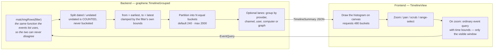
```mermaid
flowchart LR
    subgraph go["Backend — graphene.TimelineGrouped"]
        rows["matchingRows(filter)<br/><i>the same function the events list uses,<br/>so the two can never disagree</i>"]
        split["Split dated / undated<br/>undated is COUNTED, never bucketed"]
        ext["from = earliest, to = latest<br/>clamped by the filter's own bounds"]
        buck["Partition into N equal buckets<br/>default 240 · max 2000"]
        lanes["Optional lanes: group by provider,<br/>channel, user, computer or graph"]
        rows --> split --> ext --> buck --> lanes
    end

    subgraph js["Frontend — TimelineView"]
        draw["Draw the histogram on canvas<br/>requests 480 buckets"]
        zoom["Zoom / pan / scrub / range-select"]
        fetch["On zoom: ordinary event query<br/>with time bounds — only the visible window"]
        draw --> zoom --> fetch
    end

    lanes -->|"TimelineSummary JSON"| draw
    fetch -->|"EventQuery"| rows
```

Details worth knowing:

- **Lane counts travel as a bare `[]int`** aligned index-for-index with the
  bucket list, rather than repeating bucket boundaries per lane. With many lanes
  that is the difference between a small payload and a silly one.
- **Lanes are capped**, and beyond the cap the smallest fold into a single
  `other` row. A timeline with four hundred lanes is unreadable and the payload
  is wasted.
- **Degenerate spans are handled truthfully.** If every event shares one instant,
  the result is a single bucket — not identical timestamps spread across a
  fabricated range.
- **Graph lanes are resolved in the frontend.** The backend returns graph *ids*,
  because the persistence layer has no notion of graph names; the registry lives
  outside it.

---

## 10. The rules engine

### 10.1 The format

One file, one rule, one graph:

```json
{
  "format_version": 1,
  "name": "Failed Logons Then Successful Logon",
  "description": "Three failed logons followed by a success on the same computer.",
  "relation_type": "correlation",
  "algorithm": "sequence",
  "sequence": ["4625", "4625", "4625", "4624"],
  "labels": ["", "", "then succeeds"]
}
```

A rule selecting one of the other three algorithms adds the fields that matcher reads —
`match_fields`, `window_within`, `lineage_create_ids` — and the guided form shows only those,
because offering controls an algorithm ignores invites an author to fill in fields that do
nothing. [RULES.md](RULES.md) is the authority on every field; §7 there lists the algorithms
and §8 states what a match of each one **establishes**, which is the distinction that decides
how much weight a graph deserves.

`labels[i]` names the edge between `sequence[i]` and `sequence[i+1]`. An empty
entry — or a missing tail — is an untagged connection, so a rule may label only
some of its links.

**A rule's `id` is a slug of its `name`.** This has a consequence that surprises
people and is handled explicitly in [save.go](backend/rules/save.go): renaming a
rule does not edit it, it *replaces* it with a different rule, and a graph built
under the old id stops resolving. `Save` therefore reports what it actually did
rather than leaving the UI to guess.

### 10.2 The registry: builtins and user rules merged

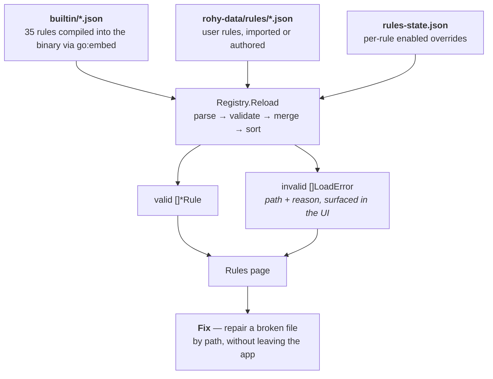
```mermaid
flowchart TD
    embed["<b>builtin/*.json</b><br/>35 rules compiled into the binary via go:embed"] --> merge
    userdir["<b>rohy-data/rules/*.json</b><br/>user rules, imported or authored"] --> merge
    state["<b>rules-state.json</b><br/>per-rule enabled overrides"] --> merge

    merge["Registry.Reload<br/>parse → validate → merge → sort"] --> valid["valid []*Rule"]
    merge --> invalid["invalid []LoadError<br/><i>path + reason, surfaced in the UI</i>"]

    valid --> ui["Rules page"]
    invalid --> ui
    ui --> fix["<b>Fix</b> — repair a broken file<br/>by path, without leaving the app"]
```

- A **user rule may override a builtin** of the same id — builtin names are not
  in the "claimed" set when checking for import collisions.
- **Import never silently replaces** an existing user rule; a collision is a
  rejection with a reason, and the file is left where it was.
- **Builtins cannot be edited in place.** _Duplicate_ makes an editable copy.
- A file that fails to load still appears, addressed **by path**, so it can be
  repaired. `ReadFile` confines that path to the rules directory — a binding that
  reads a file must not be talkable into reading an arbitrary one.

### 10.3 One validator, three consumers

Validation could easily have been written three times: once in the loader, once
in the guided form, once in the raw editor's squiggles. [validate.go](backend/rules/validate.go)
refuses that:

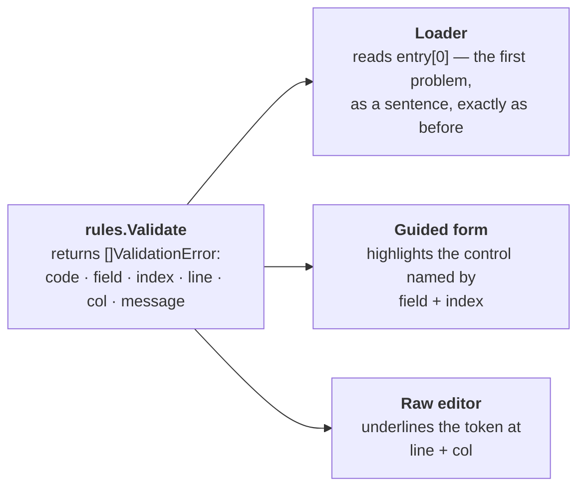
```mermaid
flowchart LR
    val["<b>rules.Validate</b><br/>returns []ValidationError:<br/>code · field · index · line · col · message"]
    val --> load["<b>Loader</b><br/>reads entry[0] — the first problem,<br/>as a sentence, exactly as before"]
    val --> guided["<b>Guided form</b><br/>highlights the control named by<br/>field + index"]
    val --> raw["<b>Raw editor</b><br/>underlines the token at<br/>line + col"]
```

Line and column are 1-based and **counted in runes**, so a description with
non-ASCII characters does not shift the caret. Both are `0` when a problem cannot
be located — a field absent from the file has no position in it.

Alongside it, [schema.go](backend/rules/schema.go) describes the format **as
data**: every field's prose, kind, allowed values and bounds, derived from the
same constants the validator reads and served to the frontend over a binding. The
guided form's controls, the raw editor's completion list, and the client-side
pre-validation are all *generated* from that one descriptor. A reflection test
asserts every exported `Spec` field appears there — so a new field cannot be
added to the format without being documented for the people who have to write it.

### 10.4 Formatting operates on bytes, never on structs

`Pretty` and `Minify` work on **raw bytes**. Round-tripping through `Spec` would
be far less code and would quietly destroy the two things the format promises to
keep: **field order**, and **any field this build does not interpret**.

Pressing "Pretty" on a rule written for a newer rohy must not delete the fields
that make it work. So the formatter decodes into an order-preserving tree and
re-renders it in the house style — one field per line, short arrays kept on one
line, because a sequence reads as a sequence when its steps sit side by side.

---

## 11. The correlation engine

`autograph` is a **pure function**: rule spec + events in, unpersisted relations
out. It never writes. That is what makes it testable in isolation and safe to
reason about.

### 11.1 The sequence algorithm, step by step

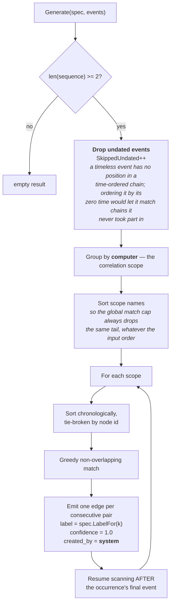
```mermaid
flowchart TD
    in["Generate(spec, events)"] --> guard{"len(sequence) >= 2?"}
    guard -- no --> empty["empty result"]
    guard -- yes --> undated["<b>Drop undated events</b><br/>SkippedUndated++<br/><i>a timeless event has no position in a<br/>time-ordered chain; ordering it by its<br/>zero time would let it match chains it<br/>never took part in</i>"]

    undated --> group["Group by <b>computer</b> — the correlation scope"]
    group --> sortsc["Sort scope names<br/><i>so the global match cap always drops<br/>the same tail, whatever the input order</i>"]
    sortsc --> loop["For each scope"]
    loop --> chron["Sort chronologically,<br/>tie-broken by node id"]
    chron --> match["Greedy non-overlapping match"]
    match --> emit["Emit one edge per consecutive pair<br/>label = spec.LabelFor(k)<br/>confidence = 1.0<br/>created_by = <b>system</b>"]
    emit --> next["Resume scanning AFTER<br/>the occurrence's final event"]
    next --> loop
```

### 11.2 A worked example

Rule: `["4625", "4625", "4624"]`. Events on computer `WS1`, already sorted:

| index | event_id | note                   |
| ----- | -------- | ---------------------- |
| 0     | 4625     |                        |
| 1     | 4672     | not in the sequence    |
| 2     | 4625     |                        |
| 3     | 4624     |                        |
| 4     | 4625     |                        |
| 5     | 4625     |                        |
| 6     | 4624     |                        |

- **Scan from 0** → matches indices `[0, 2, 3]`. Index 1 is simply skipped: the
  steps do **not** have to be adjacent. Emits edges `0→2` and `2→3`.
- **Resume at 4** (one past the match's last index — this is the non-overlapping
  rule). Matches `[4, 5, 6]`. Emits `4→5` and `5→6`.
- **Resume at 7**; `7 + 3 > 7`, loop ends.

Result: **2 matches, 4 relations.**

### 11.3 Cost

Because each successful match resumes strictly after the previous one, the
scanned segments are **disjoint**. Total scanning work per scope is therefore
linear in the number of events, plus at most one failed scan:

```
per rule:  O(E log E)   sorting   +   O(E)   matching
per run:   the dataset is read ONCE and shared by every rule
```

There is no backtracking and no combinatorial explosion — which is precisely why
the greedy formulation was chosen over "find all subsequences".

### 11.4 Determinism and the cap

Implementations must be **pure and deterministic**: same inputs, same output,
independent of map iteration order or the wall clock. Hence sorted scope names
and id tie-breaks everywhere.

`AutoGraphMaxMatches = 100000` caps completed matches. On hitting it, the scan
**keeps going** — but only to count how many more it is dropping, so the result
reports `Truncated: true` and an exact `Dropped` figure. Silent truncation is
never acceptable.

### 11.5 The prepared dataset — one sort per build, not one per rule

Every algorithm needs the same three things done first: undated events dropped, events grouped
by scope, each group sorted chronologically. Each rule used to do all three itself, so a build
of twenty rules sorted the same case twenty times.

`autograph.Prepare` does it once and hands every rule the result:

```go
func Prepare(events []*graphene.Event, need Requirements) *Dataset
func GenerateWith(spec *rules.Spec, ds *Dataset) Result
```

Three properties, each load-bearing:

- **Built to requirements.** `Requirements` is the union of what the *selected* rules read, so
  a build of sequence-only rules pays nothing for machinery it will not touch.
- **Immutable after construction.** There is no lazy memoization of partitions computed on
  first use — a mutable structure shared across rules is a data race the moment anything
  evaluates two rules concurrently, and the purity of this package is what makes the testbench
  (§11.7) a safe thing to offer at all.
- **Partitions inherit the global sort.** They are built by a stable pass over the
  already-sorted slice, so every partition is chronological without being sorted. Preparation is
  one `O(n log n)` sort plus `O(n)` per scope, not a sort per group.

Measured at 50k events, mixed algorithms — `BenchmarkBuild` against
`BenchmarkBuildPreparingPerRule`, the v0.1.0 shape kept as the comparison:

| Rules | Shared prepare | Per-rule prepare | Allocated |
| ----: | -------------: | ---------------: | --------- |
|     1 |        28.0 ms |          26.8 ms | 2.1 → 2.1 MB |
|     5 |        86.0 ms |         154.6 ms | 4.9 → 13.3 MB |
|    20 |         282 ms |           505 ms | 16.2 → **56.1 MB** |

Medians of three runs at `-benchtime=20x`; the timing spread is ~±10%, the allocation figures
are stable to the byte. Per **rule**: 28.0 → 17.2 → 14.1 ms as the count rises, against a flat
26.8 → 30.9 → 25.2 ms. The falling curve *is* the shared sort. At one rule they are identical,
exactly as they should be — there is one prepare either way.

### 11.6 Four algorithms, and what each one lets you claim

The registry is the whole extension point, and it now holds four:

```go
var registry = map[string]Algorithm{
    consts.AlgoSequence: sequenceAlgorithm{},
    consts.AlgoField:    fieldAlgorithm{},
    consts.AlgoTemporal: temporalAlgorithm{},
    consts.AlgoLineage:  lineageAlgorithm{},
}
```

🔒 A test asserts the registry and `consts.Algorithms` agree **in both directions**. Without it,
a name accepted at load with no implementation behind it would build an empty graph and look
exactly like a rule that found nothing — the validator refuses unknown names, which is also why
adding an algorithm needs no format-version bump (RULES.md §5).

The differences that matter are not in what they find but in what a match **establishes**
(RULES.md §8). Three implementation notes that are easy to get wrong:

**`field` excludes rather than buckets.** An event carrying no value for a required field is
left out and counted, never grouped under `""` — see 5.6. Buckets inherit chronological order
from the dataset, so there is no per-bucket sort anywhere in the algorithm.

**`temporal` is a sweep, not greedy-with-a-time-check.** Greedy takes the *earliest*
subsequence, which is correct when order is the only constraint. Add a window and it is not:
given `A@00:00, A@10:00, B@10:30` with a one-minute window, greedy anchors on the first `A`,
finds `B` 10m30s later, rejects — and has already walked past a valid match. Abandoning the
partition drops real matches; restarting from every failed anchor is quadratic on a log where
the anchor event is common. So it sweeps once, keeping the **most recent** event that completed
each step, which is provably sufficient: a later completion has a larger timestamp and so
satisfies the window for strictly more future events. The consequence to know is that temporal
is **latest-anchored** where sequence is **earliest-anchored**; with an unbounded window the two
would not always emit the same edges.

**`lineage` resolves parents through time, not by PID.** Windows reuses process IDs
aggressively — a busy host cycles the space in hours — so joining on the parent PID over a case
spanning days produces a confidently wrong graph in which every wrong edge looks exactly like a
right one. Each creation opens a lifetime interval for its PID, closed by that PID's next
creation or by its exit (4689); a child's parent is the process whose interval **contained** the
child's creation time. Where no interval contains it — usually because the parent predates the
log — nothing is emitted and `UnresolvedParents` is reported. Nothing is guessed.

### 11.7 Provenance, and why the testbench is ~100 lines

Every edge a rule writes now records **which rule, which occurrence, which step, and on what
grounds**:

```go
rel.StampProvenance(ruleID, algorithm, matchID, stepIndex, []string{"logon_id=0x3e7"})
```

`MatchID` is **derived, never generated** — a digest of the occurrence's own endpoints and
length. A random or counter-based id would change on every rebuild, which would defeat the
idempotency the build workflow is designed around and make two builds of one case
incomparable. `Basis` is what turns "inferred, not asserted" from a colour on the canvas into
a claim an analyst can check.

And because `autograph` returns **unpersisted** relations and cannot write, "try this rule
without committing to it" needs no sandbox, no transaction to roll back, and no second
evaluation path that might diverge from the real one. `graphbuild.DryRun` is the same call the
build makes with the persistence simply not done — and `TestDryRunWritesNothing` asserts
relations, events *and* graphs are all unchanged afterwards, because the claim is not "it
usually does not persist" but "the path contains no write".

---

## 12. Graph build — where rules become persisted graphs

`graphbuild` is the only place rules, events, the engine and persistence meet.
The contract is **one rule = one graph, N rules = N graphs**, and rebuilds are
idempotent by construction.

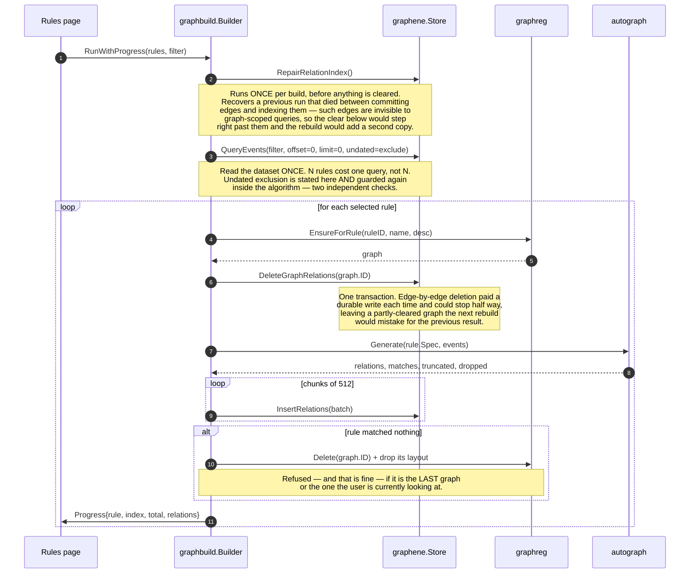
```mermaid
sequenceDiagram
    autonumber
    participant UI as Rules page
    participant B as graphbuild.Builder
    participant S as graphene.Store
    participant R as graphreg
    participant A as autograph

    UI->>B: RunWithProgress(rules, filter)
    B->>S: RepairRelationIndex()
    Note over B,S: Runs ONCE per build, before anything is cleared.<br/>Recovers a previous run that died between committing<br/>edges and indexing them — such edges are invisible to<br/>graph-scoped queries, so the clear below would step<br/>right past them and the rebuild would add a second copy.
    B->>S: QueryEvents(filter, offset=0, limit=0, undated=exclude)
    Note over B,S: Read the dataset ONCE. N rules cost one query, not N.<br/>Undated exclusion is stated here AND guarded again<br/>inside the algorithm — two independent checks.

    loop for each selected rule
        B->>R: EnsureForRule(ruleID, name, desc)
        R-->>B: graph
        B->>S: DeleteGraphRelations(graph.ID)
        Note over S: One transaction. Edge-by-edge deletion paid a<br/>durable write each time and could stop half way,<br/>leaving a partly-cleared graph the next rebuild<br/>would mistake for the previous result.
        B->>A: Generate(rule.Spec, events)
        A-->>B: relations, matches, truncated, dropped
        loop chunks of 512
            B->>S: InsertRelations(batch)
        end
        alt rule matched nothing
            B->>R: Delete(graph.ID) + drop its layout
            Note over B,R: Refused — and that is fine — if it is the LAST graph<br/>or the one the user is currently looking at.
        end
        B->>UI: Progress{rule, index, total, relations}
    end
```

Three decisions worth understanding:

**Repair before clear.** A relation whose index entry was never registered still
shows up in adjacency (adjacency reads incident edges directly) but is invisible
to graph-scoped queries (those resolve through the `graph_id` index). Structural
verification cannot catch this — the edge and its adjacency agree, so nothing is
*damaged*; a caller-encoded value simply was never written. Only `graphene`
knows how a relation encodes its own index entries, so repair lives there and is
called here.

**Empty graphs are discarded.** Keeping them would fill the graph picker with one
empty entry per rule that did not fire, and an empty graph looks exactly like one
whose results have not loaded yet. "This rule found nothing" is better said by the
run outcome, which reports zero matches. It also makes rebuilds **symmetric**: a
rule that used to match and now does not gets its graph cleared *and* removed,
rather than left as a husk of a result that is no longer true.

**Progress is per rule, not sub-rule.** A rule is the smallest unit whose result
is meaningful. Inventing intra-rule percentages would be precision the workflow
does not have.

---

## 13. Findings — the one layer authored by a person

Everything else in rohy is machine-derived: events come from EVTX, edges come
from rules, layout comes from an algorithm. Findings are the exception, and the
design follows from that.

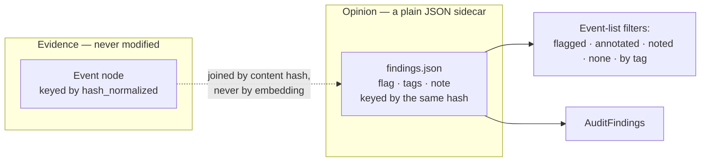
```mermaid
flowchart LR
    subgraph evidence["Evidence — never modified"]
        node["Event node<br/>keyed by hash_normalized"]
    end
    subgraph opinion["Opinion — a plain JSON sidecar"]
        f["findings.json<br/>flag · tags · note<br/>keyed by the same hash"]
    end
    node -.->|"joined by content hash,<br/>never by embedding"| f

    f --> filt["Event-list filters:<br/>flagged · annotated · noted · none · by tag"]
    f --> audit["AuditFindings"]
```

- **Keyed by content hash, not node id.** Node ids are assigned by the store; a
  content hash survives a re-ingest.
- **Bounded**: note ≤ 8000 chars, tag ≤ 64 chars, ≤ 32 tags. The frontend knows
  the same limits from consts, so the editor warns *before* a write is refused
  rather than after.
- **Debounced saves** (600 ms) with a flush on blur, so typing does not rewrite
  the sidecar on every keystroke and nothing is lost.

### The audit, and why orphans are never auto-deleted

Findings outlive the events they describe. Clear the store, ingest a different
dataset into the same folder, and every previous finding is still on disk keyed
to hashes no event can produce. Queries stay correct — a phantom hash matches
nothing — but the counts would claim work that is not there.

`AuditFindings` reconciles the two and reports `Total`, `Live`, `Orphans`, plus a
`Stale` flag meaning "the sidecar was written against a different hashing recipe
than this build produces" — in which case **every** finding orphans at once and
the cause is the build, not the data. That distinction has to be drawable by the
UI.

Orphans are **reported, never deleted**. Re-ingesting the missing source brings
the events back and the findings reattach. Deleting them would destroy
irreplaceable analyst work to tidy a number.

---

## 14. Named graphs and canvas layout

Two small sidecars, kept deliberately separate from each other and from the store:

| Package    | Owns                                              | Explicitly does **not** own            |
| ---------- | ------------------------------------------------- | -------------------------------------- |
| `graphreg` | graph id, name, description, timestamps, active   | relations (those live in the store)    |
| `layout`   | node x/y positions, viewport pan/zoom, per graph  | anything about what an event *is*      |

`Graph.RuleID` binds a graph to the rule that produces it and **survives
renaming**, so a rebuild always finds its own graph even after the analyst has
renamed it.

Two refusals are deliberate, and neither is an error:

- **The last graph cannot be deleted.** The application always needs somewhere to
  put a hand-drawn relation.
- **The graph currently being viewed is never auto-deleted.** Removing the active
  view out from under someone mid-investigation is worse than leaving one empty
  graph in the list.

The startup migration folds pre-multi-graph data forward: relations with no
`graph_id` are assigned to `Default`, and a legacy `canvas.json` is moved to that
graph's per-graph file. Every step is idempotent, which is what makes it safe to
run on **every** startup rather than gating it behind a version flag.

---

## 15. Frontend architecture

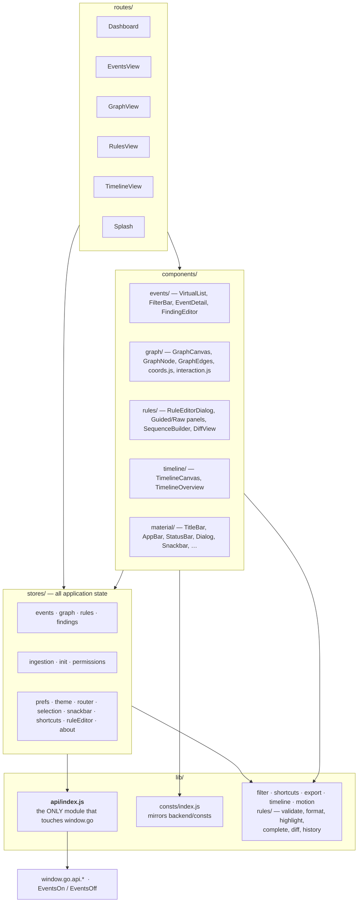
```mermaid
flowchart TD
    subgraph routes["routes/"]
        d["Dashboard"]; e["EventsView"]; g["GraphView"]; r["RulesView"]; t["TimelineView"]; s["Splash"]
    end

    subgraph comps["components/"]
        ce["events/ — VirtualList, FilterBar, EventDetail, FindingEditor"]
        cg["graph/ — GraphCanvas, GraphNode, GraphEdges, coords.js, interaction.js"]
        cr["rules/ — RuleEditorDialog, Guided/Raw panels, SequenceBuilder, DiffView"]
        ct["timeline/ — TimelineCanvas, TimelineOverview"]
        cm["material/ — TitleBar, AppBar, StatusBar, Dialog, Snackbar, …"]
    end

    subgraph st["stores/ — all application state"]
        s1["events · graph · rules · findings"]
        s2["ingestion · init · permissions"]
        s3["prefs · theme · router · selection · snackbar · shortcuts · ruleEditor · about"]
    end

    subgraph lib["lib/"]
        api["<b>api/index.js</b><br/>the ONLY module that touches window.go"]
        cons["consts/index.js<br/>mirrors backend/consts"]
        pure["filter · shortcuts · export · timeline · motion<br/>rules/ — validate, format, highlight,<br/>complete, diff, history"]
    end

    routes --> comps
    routes --> st
    comps --> st
    st --> api
    st --> pure
    comps --> pure
    comps --> cons
    api --> wails["window.go.api.*  ·  EventsOn / EventsOff"]
```

### 15.1 One door to the backend

`lib/api/index.js` is the only module that reads `window.go`. Everything else
calls its exported functions. Two payoffs:

- **Graceful degradation.** Under `vite dev` in a plain browser, `window.go` is
  undefined; calls reject with a clear message and event subscription is a no-op,
  so the UI loads instead of throwing.
- **One place to change** when a binding's shape moves.

### 15.2 Progressive loading

The events list never asks for everything. A fresh load issues **three calls in
parallel**:

```js
const [list, total, undatedHidden] = await Promise.all([
  api.queryEvents(f),                              // the first page
  api.countEvents(f),                              // the accurate total
  api.countEvents({ ...f, undated: UNDATED.ONLY }), // what this view is hiding
]);
```

The third exists so the view can **say** what it is excluding rather than quietly
dropping it. Subsequent pages append, so the loaded count grows toward the true
total and the user never perceives events as missing.

### 15.3 Constants are mirrored, not duplicated by hand

`lib/consts/index.js` mirrors `backend/consts`. Enum values (`UNDATED`,
`FINDING_FILTERS`, `TIMELINE_GROUP`, `RELATION_*`) are the **same strings** on
both sides, with the JS side commented to name its Go counterpart.

The same single-source-of-truth discipline shows up locally too.
[shortcuts.js](frontend/src/lib/shortcuts.js) is the one definition of the
keybindings; both the global handler and the help dialog read it, so a shortcut
can never work while the help claims otherwise. `NAV_ITEMS` is *derived* from
`NAV_KEYS`, so a route reachable by `Alt+<digit>` is necessarily in the menu with
that key shown beside it.

Binding choices avoid OS and browser clashes: navigation uses `Alt+digit`
(WebView2 leaves it alone) rather than `Ctrl+digit` (browser tabs) or bare
letters (which would fire while typing). Bare letters are used only inside the
canvas, and only when focus is not in a field.

### 15.4 Where global concerns are wired

`ingestion.wire()` is called in **`App.svelte`**, not in the Dashboard. The
global progress bar has to reflect a running ingest on **every** route, including
ones reached without ever mounting the Dashboard — and `IngestionBar` sits
outside the routed content so an ingest stays visible across navigation.

---

## 16. The Go ↔ JS contract

### 16.1 Seven bound structs

| Struct           | Responsibility                                                              |
| ---------------- | --------------------------------------------------------------------------- |
| `EventsAPI`      | ingestion control, event queries, counts, adjacency, timeline, export       |
| `GraphAPI`       | relations, named graphs, canvas layout, relationship inspection             |
| `RulesAPI`       | rule listing, import, export, save, delete, enable/disable, format descriptor |
| `BuildAPI`       | run correlation rules, report progress, dry-run a rule without persisting   |
| `FindingsAPI`    | flags, tags, notes, tag list, stats, audit                                  |
| `SystemAPI`      | build identity, init stages, window controls, elevation checks              |
| `MaintenanceAPI` | opt-in work over the whole case — currently the correlation-key backfill    |

`MaintenanceAPI` is separate from `SystemAPI` rather than folded into it because the two
are different concerns: `SystemAPI` reports how the **application** is doing and never
touches case data, while everything on `MaintenanceAPI` reads or rewrites the case itself
and is proportional to how large it is. Nothing on it runs at startup — the same judgement
`VerifyIndexes` already carries (§18).

Note that `App` itself is **not** bound. It manages lifecycle and holds no
business logic, so exposing it would be exposing nothing useful.

### 16.2 Events flow the other way

Method calls go frontend → backend. Anything the backend needs to *push* goes
over named channels, defined once in `consts` and reused on both sides:

| Channel             | Payload           | Meaning                             |
| ------------------- | ----------------- | ----------------------------------- |
| `init:state`        | stage / ready / failed | splash progress                |
| `ingest:started`    | `StartedEvent`    | one file began — with `N of M`      |
| `ingest:progress`   | `evtx.Progress`   | cumulative counters                 |
| `ingest:error`      | `ErrorEvent`      | non-fatal, per record or chunk      |
| `ingest:complete`   | `evtx.Summary`    | terminal, with checkpoint           |
| `ingest:cancelled`  | `evtx.Summary`    | terminal, with checkpoint           |
| `ingest:state`      | ingest state      | running / paused, for the UI        |
| `permission:warn`   | `AccessDecision`  | a channel needs elevation           |
| `rules:started` / `rules:progress` / `rules:complete` / `rules:cancelled` | build lifecycle | rule-run progress |

**Every** error crossing the boundary — emitted or returned — uses one shape:

```go
type ErrorEvent struct {
    Code    string `json:"code"`     // a stable vocabulary: parse, io, persistence, …
    Message string `json:"message"`  // human-readable
}
```

A stable `code` lets the frontend branch on the *kind* of failure — a refused
note is the caller's input being wrong, not the disk failing, and the two deserve
different messages.

### 16.3 The Emitter seam

```go
type Emitter interface{ Emit(channel string, data interface{}) }
```

Production uses `WailsEmitter`; tests inject a capturing fake. This is why
[emitter_wails.go](backend/api/emitter_wails.go) is the **only** file in the
package that imports the Wails runtime — the bindings and all their tests stay
runtime-independent, which is what allows the API layer to be tested without a
window.

---

## 17. Concurrency model

Small and deliberate. Here is the whole of it:

| Where                    | Concurrency                                                            | How safety is achieved                                              |
| ------------------------ | ---------------------------------------------------------------------- | ------------------------------------------------------------------- |
| Store open               | any number of callers                                                  | `sync.Once` in `ensure()`, giving a happens-before edge              |
| Ingest producer          | 1 goroutine                                                            | owns the offset channel; blocks on backpressure                      |
| Ingest workers           | 4 goroutines                                                           | each opens its **own** file handle — parsing seeks                   |
| Ingest sink              | **1 goroutine**                                                        | all counters and Reporter calls are single-threaded by construction  |
| Order cache              | concurrent readers and writers                                         | `sync.Mutex` + a version counter that rejects stale results          |
| Payload store            | ingest appends while the UI reads                                      | `sync.RWMutex` — appends take the write lock, reads the read lock    |
| Sidecar stores           | UI reads while the pipeline writes                                     | `sync.Mutex` per store                                               |
| Pause gate               | UI flips, pipeline observes                                            | mutex plus **replaced** channels, so a waiter cannot latch a stale one |
| Cancellation             | everywhere                                                             | one `context.Context` per run, checked at batch and rule boundaries  |

The rule of thumb the code follows: **make the hot path single-goroutine and put
the concurrency at the edges.** The sink is the clearest example — it trades a
little throughput for the complete absence of a class of bug.

The pipeline also ships both `race_on_test.go` and `race_off_test.go`, so the
suite behaves sensibly with and without `-race`.

---

## 18. Failure and recovery

This table is the most useful page in the document if you are debugging a
corrupted case.

| Failure                                              | What survives                              | How it recovers                                                                   |
| ---------------------------------------------------- | ------------------------------------------ | --------------------------------------------------------------------------------- |
| Crash mid-ingest                                     | Everything flushed before the crash        | Re-run the ingest; hash idempotency collapses the overlap to occurrence counts     |
| Crash between payload write and event commit         | Orphan bytes in `payloads.log`             | Harmless waste; reclaimed by re-ingesting                                          |
| Crash between event commit and index registration    | The event exists but is not findable        | `RebuildIndexes` restores structure; re-running the write restores property entries |
| Crash between edge commit and index registration     | The edge exists but belongs to no graph     | `RepairRelationIndex` — and every rule build calls it first                         |
| Crash during live capture                            | The bookmark trails the durable write       | Next run re-reads a little; dedup collapses it. **It can never skip.**              |
| Uncompacted close (kill, power loss)                 | The WAL                                    | Replayed automatically on next open                                                 |
| Corrupt capture sidecar                              | —                                          | Treated as "no positions": costs a re-read, not a failed startup                     |
| Findings pointing at absent events                   | Every finding                              | Reported as orphans by `AuditFindings`; **never** auto-deleted                       |
| Findings written by a different hashing recipe       | Every finding                              | `Stale: true` — the UI can say "this is the build, not your data"                    |
| A rule file that will not parse                      | The file, untouched                        | Listed with path + reason; repairable in-app via _Fix_                               |
| Half-cleared graph                                   | —                                          | Cannot happen: clearing a graph is one transaction                                   |

`VerifyIndexes` is deliberately **not** a startup step. Verification is
proportional to the whole store, and a structurally damaged index section is
already rejected while the file is parsed — so running it on every open would tax
every launch to re-prove something almost always true. Its trigger points are the
test suite and an explicit user-initiated check.

---

## 19. Performance decisions ledger

The full reasoning is in [PERFORMANCE.md](PERFORMANCE.md). The short version —
**every entry exists because a measurement produced a surprise**:

| Decision                                            | Measured effect                                             |
| --------------------------------------------------- | ----------------------------------------------------------- |
| Move raw record + parsed fields to a cold store      | 3137 → 867 B/event resident. **70% of memory removed.**      |
| Do **not** declare the timestamp key ordered         | Open at 100k events: 8.0 s → **0.8 s**                       |
| Decode a minimal sort view instead of the full Event | Ordering no longer materialises kilobyte payloads            |
| Cache the id ordering against filter + version       | Paging hydrates one page, not the whole matching set         |
| Batch relation writes (512 per commit)               | Rule builds go from write-bound-per-edge to one commit/chunk |
| Batch dedup increments                               | Removes a durable write per duplicate                        |
| `Degree(id, nil)` over the typed form                | The typed form is ~**488×** dearer — it inspects every label |
| `EdgesOf(..., nil)` — no edge-type filter            | `EdgeRelation` is the only label rohy writes, so filtering costs and selects nothing extra |
| Store the correlation projection **by position**     | +138 B/event saved against the same values keyed by name      |
| Bound each correlation slot to its own domain        | Format worst case 819 → **324 B/event**; 71 B on a real 4688 |
| Prepare the correlation dataset **once per build**   | 20 rules: 480 → **222 ms**, and 56.1 → **16.2 MB** allocated  |
| Index `rule_id` on edges, but not `match_id`         | Low-cardinality answers "which edges did this rule produce"; a near-unique key is the shape that cost 8.0 s at open |

That `EdgesOf` entry carries a standing caveat in the source: **if a second edge type is
ever introduced, that call must filter again.** It is one reason process lineage models
ancestry as event → event edges rather than introducing a `Process` node type (§11.6).

The cost model in one table — know what dominates before optimising anything:

| Layer                     | What dominates                          | What does **not**                          |
| ------------------------- | --------------------------------------- | ------------------------------------------ |
| Event queries             | Decoding matched records                | Locating candidate ids                     |
| Ingest / graph build      | The number of **durable commits**       | Property encoding                          |
| Store open                | Loading the property index              | Loading the graph itself (~131 ms at 100k) |
| Ordering / paging         | Decoding a minimal per-node view        | Re-querying — the order is cached          |

> **In rohy, making a lookup asymptotically faster usually buys nothing, because
> the lookup is not the cost.** Reducing how many records get decoded, or how many
> commits get made, usually buys a lot.

---

## 20. Testing strategy

**482 Go test functions** and **364 frontend test cases**, and both suites run in
CI on every platform before any artefact is packaged.

| Kind                | Where                                                       | What it proves                                          |
| ------------------- | ----------------------------------------------------------- | -------------------------------------------------------- |
| Unit                | throughout                                                  | pure logic — normalizers, validators, coords, filters     |
| Consistency         | `graphene_consistency_test.go`                              | a write path left the index truthful                      |
| Scale               | `evtx/scale_test.go`                                        | memory stays bounded as input grows                       |
| Race                | `race_on_test.go` / `race_off_test.go`                      | the pipeline is clean under `-race`                       |
| Benchmarks          | `graphene_bench_test.go`, `*_lifecycle_bench_test.go`        | the numbers in PERFORMANCE.md are reproducible            |
| Lifecycle           | `api_lifecycle_test.go`                                     | startup/shutdown ordering, including drain-before-close   |
| Reflection          | `rules/schema_test.go`                                      | every `Spec` field is documented in the editor descriptor |
| Crash / idempotency | `graphene_*` + `evtx_*`                                     | an interrupted build re-runs without duplicating          |

Two testing choices worth copying:

- **In-memory backends have identical semantics** to the disk ones, so nothing
  behaves differently under test than in production. (With one honest caveat,
  recorded in PERFORMANCE.md: **benchmark the disk backend**, because in-memory
  runs understate write-path changes badly — commit count only costs on disk.)
- **The interfaces exist for the fakes.** `EventSink`, `Reporter`, `Emitter`,
  `LayoutStore`, `PositionStore` all exist so a test can substitute something
  trivial and assert on the calls.

---

## 21. Build and release

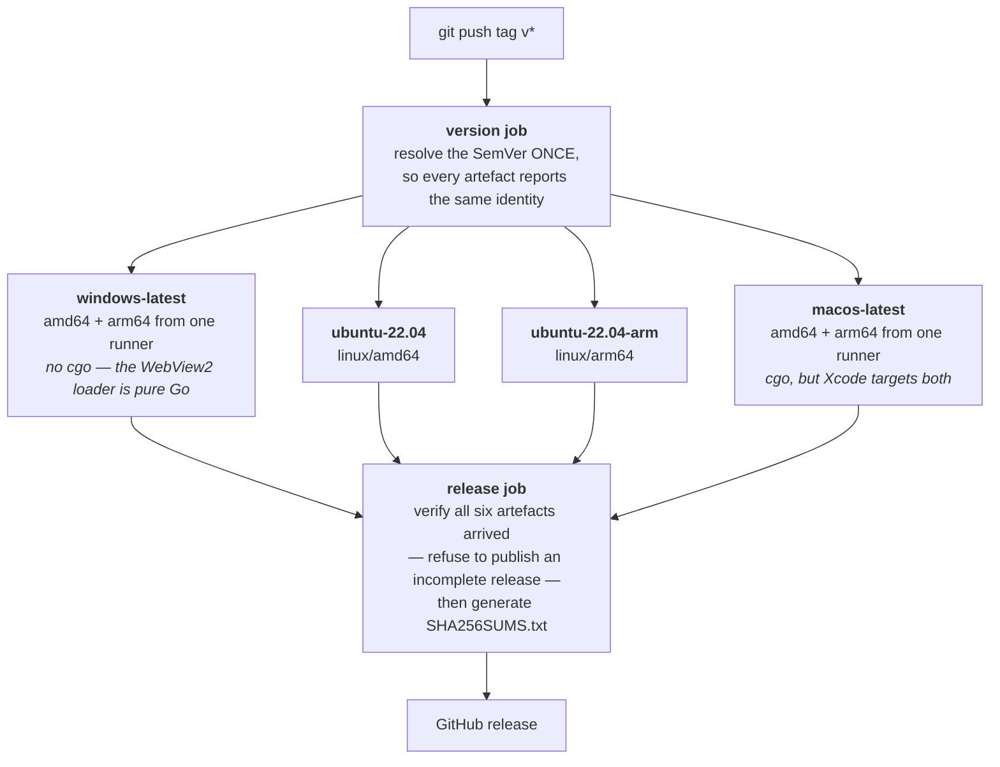
```mermaid
flowchart TD
    tag["git push tag v*"] --> ver["<b>version job</b><br/>resolve the SemVer ONCE,<br/>so every artefact reports the same identity"]

    ver --> win["<b>windows-latest</b><br/>amd64 + arm64 from one runner<br/><i>no cgo — the WebView2 loader is pure Go</i>"]
    ver --> lin1["<b>ubuntu-22.04</b><br/>linux/amd64"]
    ver --> lin2["<b>ubuntu-22.04-arm</b><br/>linux/arm64"]
    ver --> mac["<b>macos-latest</b><br/>amd64 + arm64 from one runner<br/><i>cgo, but Xcode targets both</i>"]

    win --> gate; lin1 --> gate; lin2 --> gate; mac --> gate

    gate["<b>release job</b><br/>verify all six artefacts arrived<br/>— refuse to publish an incomplete release —<br/>then generate SHA256SUMS.txt"]
    gate --> pub["GitHub release"]
```

Every build job runs `go test ./backend/...` **and** `npm test` before it builds.

Two guarantees are inherited from the local build scripts and must not be
weakened in CI:

1. **`frontend/dist` is deleted before every build and is never cached.** The Go
   binary embeds whatever is in `dist`, so a stale `dist` ships an old UI behind
   a new backend.
2. **Version metadata is injected at link time and reflects reality** — including
   marking a dirty tree with a `-dirty` suffix — so an artefact can always say
   exactly what it was built from.

Linux builds against WebKitGTK **4.0** rather than 4.1 deliberately, to keep the
artefact usable on older distributions; the README states 4.0 as the runtime
requirement to match.

```go
// backend/version — one source of truth, injected via -ldflags
var (
    Version = "0.0.1"   // overridden at link time
    Commit  = "dev"
    Date    = "unknown"
)
```

Everything that shows a version — the About dialog, the window, the README's
claim — reads from here, so the surfaces cannot drift apart. An unstamped local
build reports `Development: true` and the UI **says** it is a dev build rather
than presenting it as a release.

---

## 22. How to extend rohy

Practical recipes. Each lists every file you must touch — the point being that
the design keeps these lists short.

### Add a new filter field to the events list

1. `backend/consts` — add the property key if it should be indexed.
2. `graphene/schema.go` — add it to `indexValues()` **and** decide whether it
   belongs in `searchBlob`.
3. `graphene/graphene_query.go` — add it to `EventFilter` and either
   `propertyFilters()` (indexed) or `matchesPostHydration()` (not indexed).
4. `graphene/graphene_order.go` — if it is not indexed, add it to
   `eventSortView` and `matchesSortView`, **and add it to `orderKey()`**.
5. `api/contracts.go` — add it to `EventQuery`; map it in the binding.
6. `frontend/src/lib/filter.js` + `FilterBar.svelte` — form field and mapping.

> **The step people forget is 4's `orderKey()`.** Miss it and paging a filtered
> list will be served the *previous* filter's cached ordering. There is a comment
> in the source saying exactly this, because it has to be said.

### Add a field to the rule format

1. `rules/rules.go` — add it to `Spec`.
2. `rules/validate.go` — validate it, with a stable code and a located error.
3. `rules/schema.go` — describe it: prose, kind, allowed values, bounds, group.
4. `RULES.md` — document it.

Both editors and the client-side pre-validation regenerate themselves from step
3. A reflection test **fails the build** if you skip it.

### Add a correlation algorithm

1. Implement `autograph.Algorithm` — pure, deterministic, writes nothing, and does not
   mutate the `Dataset` it is handed (it is shared by every rule in the build).
2. Register it in `autograph.registry`, and add a descriptor to `consts.Algorithms` naming
   the fields it reads. 🔒 A test asserts the two agree in **both** directions.
3. Describe any new field in `rules/schema.go` with `AppliesTo` naming your algorithm, and
   validate it in `rules/validate.go` — dispatching on the algorithm, not unconditionally.
4. Add fixture cases to `backend/rules/testdata/validation-cases.json` **first**: it drives
   both the Go and the JS validator, so a rule enforced on one side only is a red test.
5. Document it in RULES.md §7 and §8 — especially §8, which states what a match *establishes*.

No caller changes: `graphbuild` dispatches through `autograph.GenerateWith`. Adding an
algorithm does **not** bump the rule format version — a build that lacks the implementation
refuses the name, which is the guard a version would otherwise be (RULES.md §5).

### Add a correlation field

1. **Append** to `consts.CorrelationSlots` — never reorder or reuse a slot (§5.6).
2. Add its source field names, class and length bound alongside.
3. Bump `consts.CorrelationKeyVersion`, so existing events become detectably stale and the
   backfill re-reads them.
4. Check `TestCorrelationProjectionBudget` still passes. If it does not, shrink the
   vocabulary — do not raise the ceiling.

### Add an ingestion source

1. Write a reader that produces `chunkResult` values.
2. Write a normalizer that produces `*graphene.Event` — **hashing over the same
   ordered fields** as the existing ones, or cross-source dedup breaks.
3. Dispatch to it in `evtx.Ingest`.
4. Add a `consts.SourceType*`.

Reuse `runSink` unchanged. Dedup, batching, bookmarks, progress and crash-safety
come for free — that is the entire reason the sink is a separate function.

### Add a page

1. `frontend/src/routes/YourView.svelte`.
2. `lib/consts` — add the route id and its label.
3. `lib/shortcuts.js` — add it to `NAV_KEYS`; **the menu derives itself.** Add the binding to
   `SHORTCUTS` too, or the self-documentation test fails.
4. `App.svelte` — add it to the route switch.
5. Add it to `frontend/src/components/smoke.test.js`. Svelte compiles for the server, so a
   component can be rendered in plain Node — no jsdom, no testing-library. It catches a
   `ReferenceError` that `vite build` cannot, because an undefined identifier in a `<script>`
   block is legal JavaScript.

---

## 23. Where the sharp edges are

An honest list, for anyone about to change something.

- **`orderKey()` must cover every field that changes what matches.** Adding a
  filter field and forgetting this yields wrong results, not slow ones.
- **Cross-source dedup depends on two normalizers hashing identically.** The
  file path and the live XML path must agree on field order forever.
- **`EdgesOf(..., nil)` assumes one edge label.** Introduce a second edge type
  and that call — and the reasoning around `RelationsOf` — must change.
- **A rule's id is a slug of its name.** Renaming replaces rather than edits.
  Anything that stores a rule id (graphs do) must cope.
- **`payloads.log` never shrinks.** Deletes do not reclaim. Space comes back by
  re-ingesting.
- **`Undated` defaults differ by layer on purpose.** The events view includes
  undated records; `graphbuild` excludes them explicitly and the algorithm guards
  it again. Two independent checks, because a timeless record in a time-ordered
  matcher is a correctness bug, not a display bug.
- **Live capture is Windows-only**, split across `_windows.go` / `_other.go`
  build-tagged files. Changing the live path means changing both.
- **`CorrelationSlots` is append-only** (§5.6). Reordering a slot reinterprets every stored
  event with nothing reporting an error.
- **A field that changes what an EXISTING algorithm matches is the one thing that bumps the
  rule format version.** A new algorithm does not — its name is its own guard. This is the
  distinction RULES.md §5 exists to state, and it is easy to get backwards.
- **`vite build` passing does not mean a Svelte component runs.** An undefined identifier in a
  `<script>` block is legal JavaScript, so the compiler cannot object and the failure appears
  at runtime as a blank page. Five defects reached review this way; `components/smoke.test.js`
  is what catches them now.
- **Inside `$effect`, `x += 1` on `$state` is an update loop.** It reads the value as well as
  writing it, so the effect depends on its own output. Write-only assignment is safe; keep the
  counter in a plain variable and assign the reactive one from it.
- **A CSS animation runs once per element lifetime.** Anything that must re-play needs its
  key to change — persist what should move (so transitions animate), re-key what should
  re-draw.

---

## 24. Further reading

| Document                             | What it covers                                                                      |
| ------------------------------------ | ------------------------------------------------------------------------------------ |
| [README.md](README.md)               | Install, usage, the built-in rule library                                            |
| [RULES.md](RULES.md)                 | The complete rule format — every field, validation, the extensibility contract        |
| [PERFORMANCE.md](PERFORMANCE.md)     | The measured cost model and the rules that follow from it                            |
| [RELEASE_NOTES.md](RELEASE_NOTES.md) | What shipped in the current release, and its known limitations                       |

The single most useful habit when working in this codebase: **read the package
doc comment before the code.** Nearly every non-obvious decision in rohy is
explained where it was made, usually with the measurement that forced it.

---

MIT licensed. © 2026 aoiflux.
